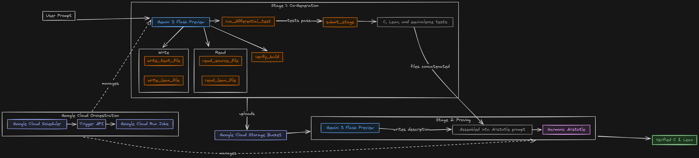

# Invariant - Verified Code Generation (Anneal)



## Overview

Anneal is the backend Invariant calls into when a user requests "Verified Code." Based on Gemini 3, it generates C and Lean code together, differential tests them to establish that the C code is equivalent to the Lean, then submits the Lean to Harmonic's Aristotle for proving.

## Architecture

The system consists of two main components:

1.  **Trigger API**: A Flask-based REST API that manages job submissions, polls for proof completion, and serves generated artifacts.
2.  **Anneal Worker**: A stateless worker (deployed as a Google Cloud Run Job) that executes the generation and verification pipeline.

### Pipeline Stages

The `main.py` entry point orchestrates the following stages:

#### Stage 1: Co-Generation (`stages/cogeneration.py`)
*   **Input**: Natural language prompt.
*   **Process**:
    *   Gemini generates a C implementation and a corresponding Lean 4 specification side-by-side.
    *   It generates a "Differential Test Suite" (C inputs and expected outputs).
    *   It compiles the C code and the Lean specification.
    *   It executes the C code and the Lean model on the test suite to ensure functional equivalence (Differential Testing).
    *   This loop repeats (up to a fixed number of turns) until the build passes, tests pass and Gemini submits to Stage 2.
*   **Output**: Valid C source (`generated/*.c`) and Lean specification (`spec/Src`).

#### Stage 2: Proving (`stages/proving.py`)
*   **Input**: Lean specification and implementation from Stage 1.
*   **Process**:
    *   The system generates a project description for the Aristotle prover.
    *   It submits the `Verif.lean` file and dependencies to the Aristotle API.
    *   The job enters a "polling" state while Aristotle attempts to prove the theorems (functional correctness, safety, termination).
*   **Output**: A proof request ID (`aristotle_id`).

## Codebase Structure

*   **`anneal/`**: Root directory.
    *   **`main.py`**: Entry point for the worker. Handles argument parsing, GCP context, and stage orchestration.
    *   **`trigger_api/`**: The REST API application (`main.py`, `Dockerfile`).
    *   **`stages/`**: Logic for each pipeline stage.
        *   `cogeneration.py`: LLM interaction loop.
        *   `diff_test.py`: Differential testing logic (C vs Lean).
        *   `proving.py`: Aristotle integration.
        *   `llm.py`: Shared LLM utilities with rate-limiting and tool execution.
    *   **`spec/`**: The Lean 4 project template.
        *   `Src/`: Source for generated Lean files.
        *   `lakefile.toml`: Lean build configuration (includes `maxHeartbeats` settings).
    *   **`generated/`**: Sandbox for generated C files.

## Usage

### Local Development

1.  **Build**:
    ```bash
    # Requires Lean 4 and Lake installed
    lake build
    ```

2.  **Run Generation**:
    ```bash
    python main.py --prompt "Implement a double-linked list with O(1) append"
    ```

### Cloud Deployment

The system is deployed on Google Cloud Platform:
*   **GCP Cloud Run Job**: `anneal-job` (Worker)
*   **GCP Cloud Run Service**: `anneal-api` (Trigger API)
*   **GCP Cloud Scheduler**: Triggers `/poll` every 15 minutes.

**Deployment**:
Deployment is managed via standard Docker workflows.
1.  Build the job image (`Dockerfile` in root).
2.  Build the API image (`trigger_api/Dockerfile`).
3.  Deploy efficiently to Google Cloud Run.

## API Endpoints

*   `POST /submit`: Submit a new job (`{"prompt": "..."}`).
*   `GET /status/<job_id>`: Check job progress.
*   `GET /files/<job_id>/download`: Download all artifacts (C code, Lean spec, Proofs) as a ZIP.

In addition to this README, further documentation inline in Python files.